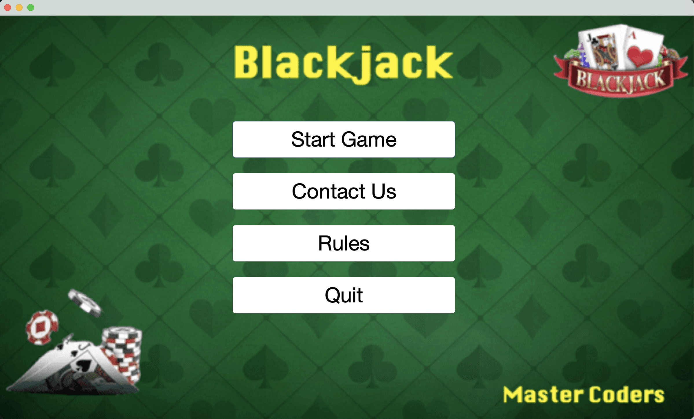
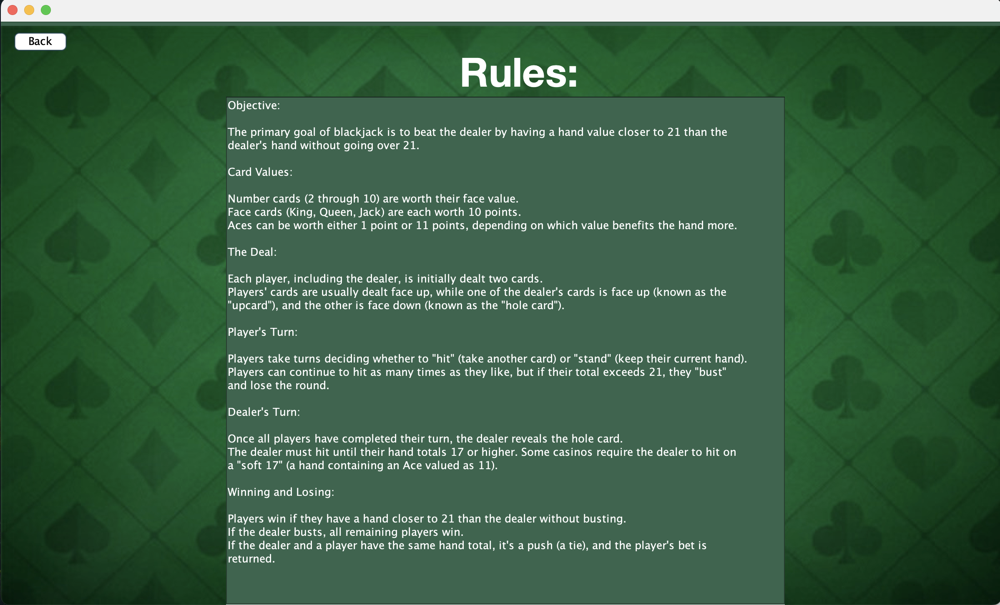
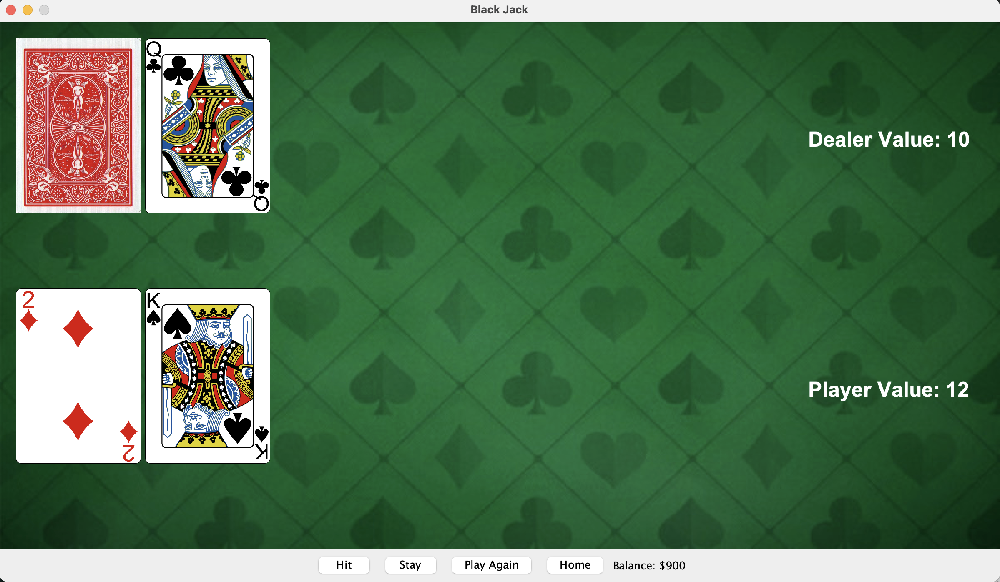
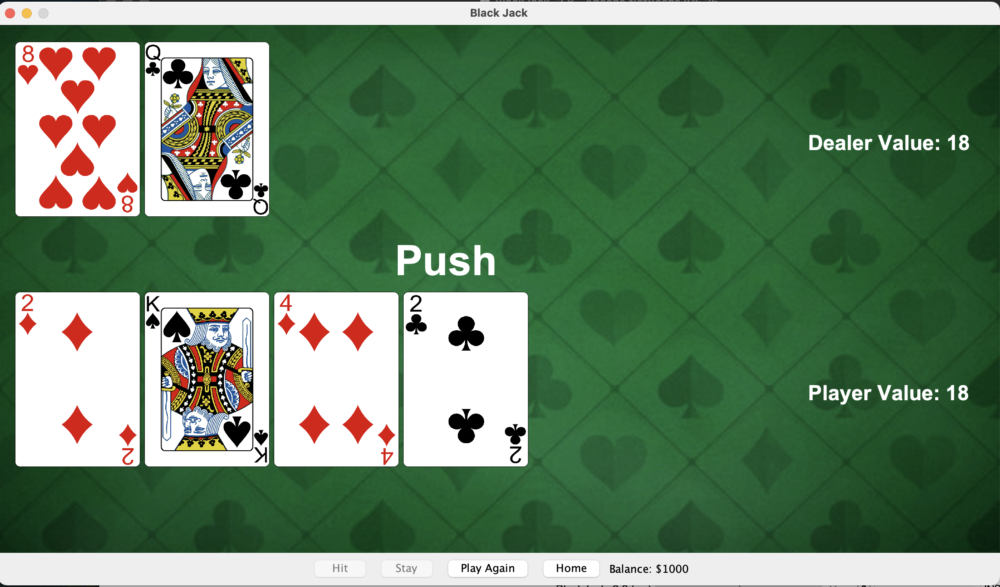
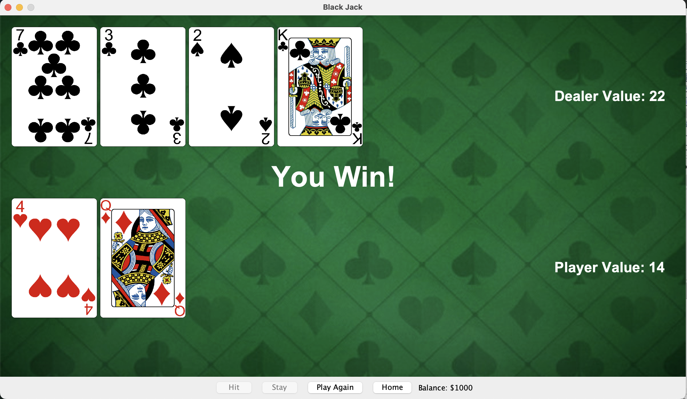
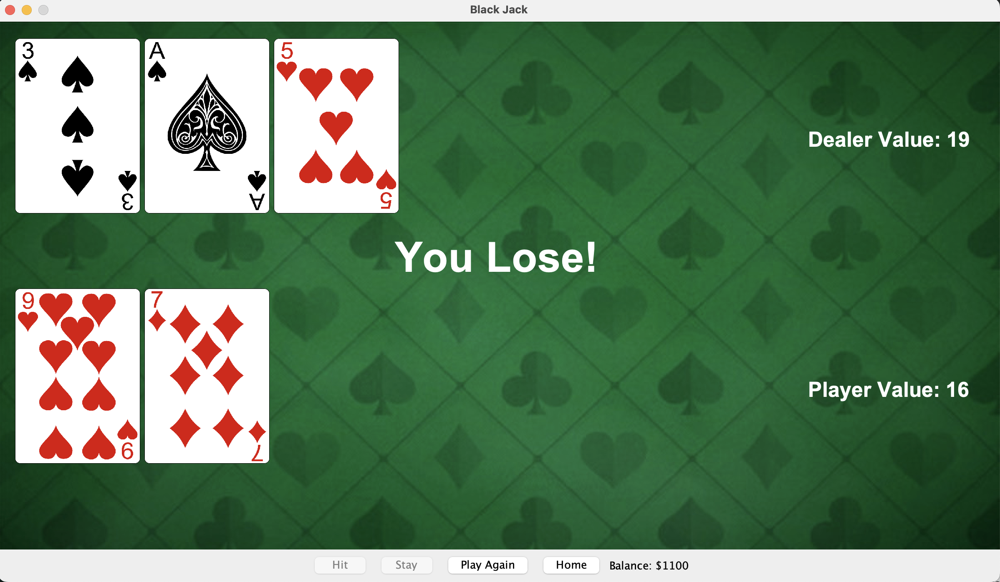

# 🃏 Blackjack Game

A simple browser-based Blackjack game built using HTML, CSS, and JavaScript. Developed as the **final project for my Computer Science 225 course**, this game simulates a casino-style Blackjack experience with betting, dealer logic, and an interactive UI.

## 📸 Screenshots

| Home Screen | Contact Page |
|-------------|--------------|
|  |  |

| Rules Page | Gameplay |
|------------|----------|
|  |  |

| Game Results: Push / Win / Lose |
|---------------------------------|
|    |

---

## 🛠️ Features

- Player vs. Dealer Blackjack logic (hit, stand, win, lose, draw)
- Manual betting before each round
- Real-time score display and win tracking
- Dynamic deck shuffling and dealing
- Clean and responsive UI
- Error handling for edge cases (e.g., running out of money)

---

## 🧰 Tech Stack

- **HTML5** – markup for structure
- **CSS3** – layout and styling
- **JavaScript (ES6)** – interactivity
- **Java** – game logic

---

## 🚀 How to Run

This project was built using **Apache NetBeans**.

1. **Clone the repository**
   ```bash
   git clone https://github.com/SammyBolger/blackjack-game.git
